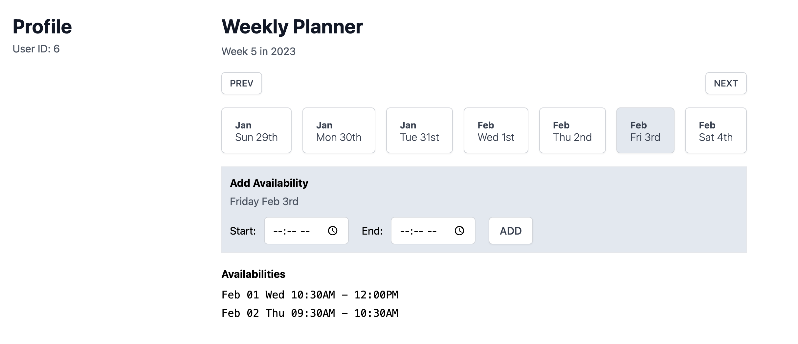

# GetSetup Frontend Coding Challenge

This is a coding challenge project for GetSetup Frontend Role.

## Assumptions

- Minimal but practical design
- No authentication to save some time. Guide ID is specified in the dev env file.
- No tests as there is not listed in the instructions but if time allows I would have added.

## Decisions

Were the instructions clear?
- For the most part, yes. But there is one thing, I might have misunderstood was this emphasis on "a given week" in

	>	submit their "teaching availability" for a given week

	I interpreted this as a weekly planner type of UI. As such UI is not common, I could not find a component that does what I needed. Therefore, I decided to build one from scratch.

Have I used a framework such as Remix, Next.js, etc?
- No, I decided not to use these frameworks because I wanted to submit a separate backend project.

What does the setup involve?
- "Create React App", "Prettier", and "Tailwind"
